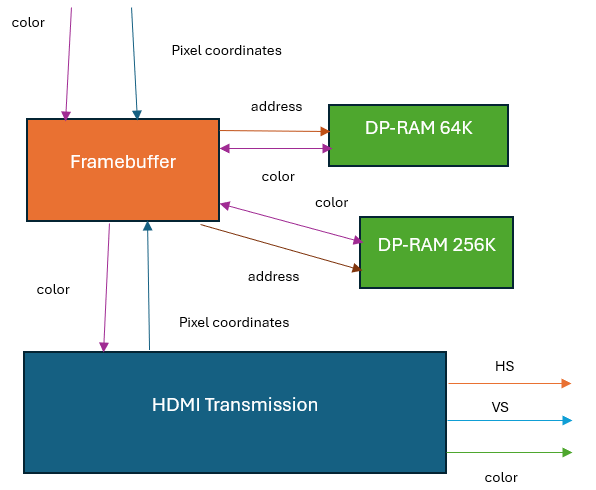

This part is about the HDMI driver system. The hdmi_display_sys verilog file is the top entity. It uses Avalon memory map interface to receive the data, stores that data into dual port RAM and display it via HDMI interface. The resolution of this hdmi system is 640x480. The architecture of the system is shown below:

The HDMI driver will seperate the 32 bits data value into pixel coordinate and 8-bits color. Each pixel coordinate occupies 10 bits, which means the data format is {x(10 bits), y(10 bits), color(8 bits)} or in the c software:
uint32_t data = pixel_x<<18|pixel_y<<8|color.   
The reason for the 2 separated dual port RAM module is because of the waste of memeory and the Quartus synthesis program. Although the 640x480x8 bits still fits inside the Cyclone V memory, the Quartus program synthesises it incorrectly due to memory waste. The video [Frame Buffer Pixel Generation Circuit](https://www.youtube.com/watch?v=SqXgRnGXj8I) explains this perfectly. I highly recommend to watch it to understand for the Frame Buffer circuit in FPGA. 

The HDMI_TX is the modified code from the Terrasic example code provided for the DE10 Nano broad on how to generate HDMI video pattern.